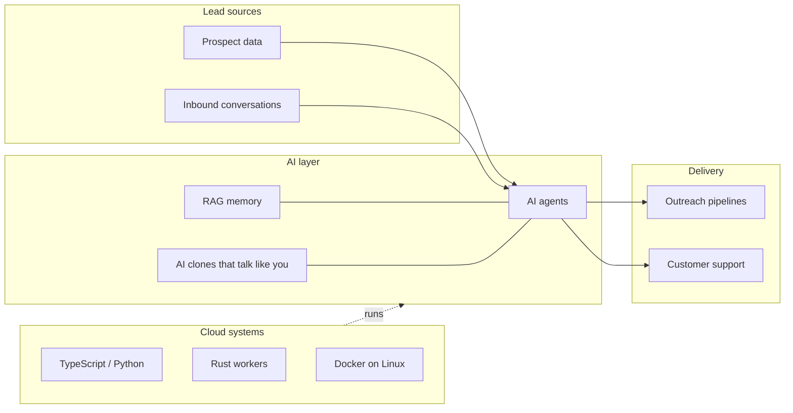

<h1 align="center">Jean Carrasco</h1>

  <a href="https://www.jeancarrasco.com/en">
    <picture>
      <source media="(prefers-color-scheme: dark)" srcset="https://readme-typing-svg.demolab.com?font=Fira+Code&weight=600&size=22&duration=3000&pause=800&color=58A6FF&center=true&vCenter=true&width=600&lines=Founder+%26+CEO+at+QueryBay;I+build+AI+automation+that+scales;AI+Agents+%C2%B7+Lead+Gen+%C2%B7+Cloud+Systems"/>
      
    </picture>
  </a>

  
  
  
  

  
  
  
  

> [!NOTE]
> Currently building **QueryBay**, an AI automation platform for outreach and customer support.

---

### About me

I'm an **industrial and software engineer turned founder**. I spent years running warehouses and leading teams of up to 60 people, then moved that operations mindset into software. Today I build **AI agents, lead-generation pipelines, and scalable cloud systems**, and I founded **QueryBay** to productize AI automation for other companies.

- Building QueryBay: an AI automation platform for outreach and customer support
- Focused on AI agents, RAG, and "AI clones" that talk like you
- Comfortable across the stack: TypeScript and Python on the front, Rust and Linux infra underneath
- Operating bilingually across the US and LATAM (Spanish, English, Portuguese)

---

### How the pieces fit together

---

### Tech stack

<b>AI &amp; Automation</b>

 

<b>Languages</b>

 

<b>Frameworks &amp; Frontend</b>

 

<b>Data &amp; Cloud Infra</b>

 

---

### Featured projects

| Project | What it does |
| --- | --- |
| **[QueryBay](https://www.jeancarrasco.com/en)** | AI automation platform for outreach and customer support |
| **AI Clones** | Personalized AI agents that talk like you, built on top of LLMs and RAG |
| **Outreach Automation Engine** | Lead generation and pipeline automation at scale |
| **Industrial Ops Automation** | Warehouse and inventory automation from my operations days |

---

### GitHub stats

  <picture>
    <source media="(prefers-color-scheme: dark)" srcset="https://github-readme-stats-one-beta-48.vercel.app/api?username=jeancarrascodv&show_icons=true&include_all_commits=true&count_private=true&theme=tokyonight&hide_border=true&bg_color=00000000"/>
    
  </picture>
  <picture>
    <source media="(prefers-color-scheme: dark)" srcset="https://github-readme-stats-one-beta-48.vercel.app/api/top-langs/?username=jeancarrascodv&layout=compact&langs_count=8&count_private=true&theme=tokyonight&hide_border=true&bg_color=00000000"/>
    
  </picture>

  <picture>
    <source media="(prefers-color-scheme: dark)" srcset="https://streak-stats.demolab.com?user=jeancarrascodv&theme=tokyonight&hide_border=true&background=00000000"/>
    
  </picture>

  <picture>
    <source media="(prefers-color-scheme: dark)" srcset="https://github-readme-activity-graph.vercel.app/graph?username=jeancarrascodv&hide_border=true&bg_color=00000000&color=c9d1d9&title_color=58a6ff&line=58a6ff&point=58a6ff&area=true&area_color=58a6ff"/>
    
  </picture>

  <picture>
    <source media="(prefers-color-scheme: dark)" srcset="https://raw.githubusercontent.com/jeancarrascodv/jeancarrascodv/output/snake-dark.svg"/>
    
  </picture>

<b>Deep dive: languages, activity and habits</b>

 

  <picture>
    <source media="(prefers-color-scheme: dark)" srcset="https://raw.githubusercontent.com/jeancarrascodv/jeancarrascodv/main/metrics/metrics.dark.svg"/>
    
  </picture>

---

  <i>Let's build something that scales. Reach out at <a href="https://www.jeancarrasco.com/en">jeancarrasco.com</a>.</i>

